<picture>
  <source media="(prefers-color-scheme: dark)" srcset="./img/header-dark.svg">
  
</picture>

  <a href="https://aymksen.github.io"><picture><source media="(prefers-color-scheme: dark)" srcset="./img/btn-portfolio-dark.svg"></picture></a>
  <a href="https://www.linkedin.com/in/aymksen/"><picture><source media="(prefers-color-scheme: dark)" srcset="./img/btn-linkedin-dark.svg"></picture></a>
  <a href="mailto:aymksen@gmail.com?subject=Hi%20Aymen"><picture><source media="(prefers-color-scheme: dark)" srcset="./img/btn-email-dark.svg"></picture></a>
  <a href="https://aymksen.github.io/Resume.pdf"><picture><source media="(prefers-color-scheme: dark)" srcset="./img/btn-resume-dark.svg"></picture></a>

 

I build web apps end to end: React and TypeScript for the interface, Node.js for the API, MySQL or PostgreSQL underneath. I'm happy to hand the boring parts to an agent in the terminal, and slow to merge anything I haven't read myself.

Before all this I studied industrial automation, which is probably why I like things explicit.

### Right now

- Working student at **Tailorlux** in Münster, writing the Python and SQL tooling the team relies on
- M.Sc. at the **University of Münster**

### Toolbox

  <picture>
    <source media="(prefers-color-scheme: dark)" srcset="https://skillicons.dev/icons?i=ts%2Creact%2Cnextjs%2Cnodejs%2Cexpress%2Cmysql%2Cpostgres%2Cpython%2Ctailwind%2Cvite%2Cdocker%2Cgit%2Cgithubactions&theme=dark">
    
  </picture>

 

Also around as <a href="https://twitter.com/Aymksen">@aymksen on X</a>, <a href="https://instagram.com/aymksen">Instagram</a> and <a href="https://codepen.io/aymksen">CodePen</a>.
